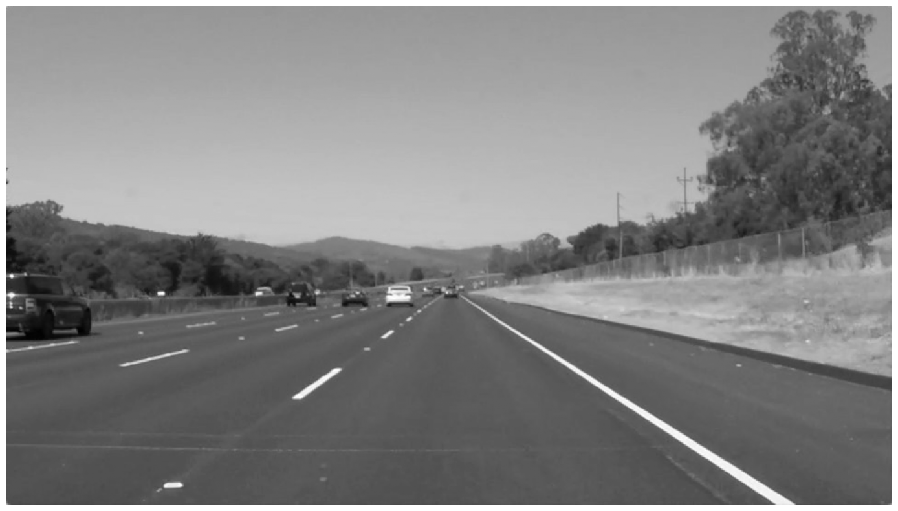
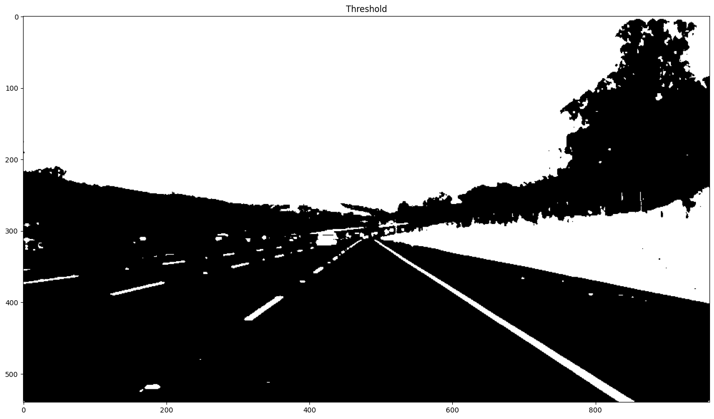
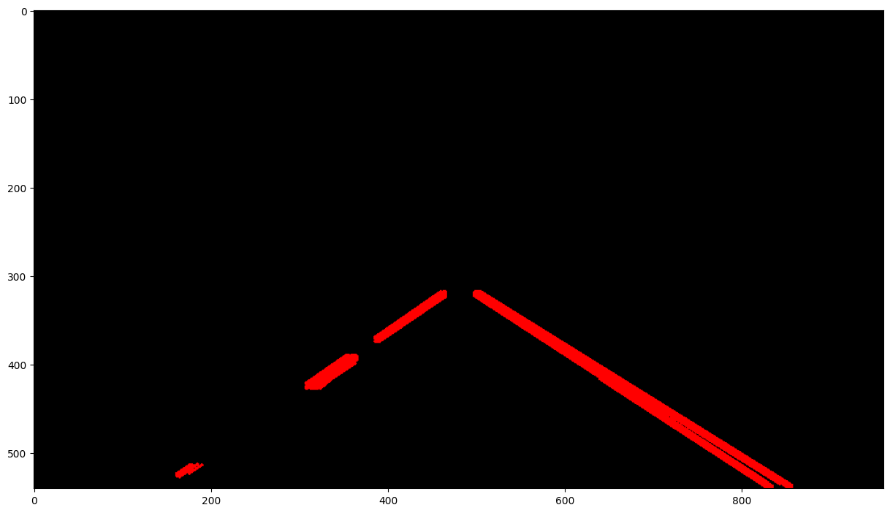
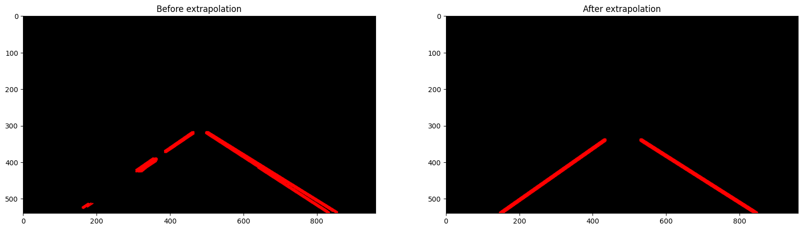

#  Lane Detection

##  Aim

To implement a basic lane detection pipeline using OpenCV by completing missing code segments at specified locations.

---

## Learning Objective

* Understand each stage of image processing
* Learn how to build a complete computer vision pipeline
* Practice writing code in guided sections

**Important Instruction:**
👉 Write code **ONLY in places marked as `# Your Code Here`**
👉 Do NOT modify any other part of the code

---

##  Software Used

* Anaconda – Python 3.7
* Jupyter Notebook / VS Code
* OpenCV (cv2)
* NumPy
* Matplotlib

---

##  Algorithm & Explanation

##  Developed By

* **Name:** Ashqar Ahamed S T
* **Register No:** 212224240018

---

###  Step 1: Import Libraries

```python
import cv2
import numpy as np
import matplotlib.pyplot as plt
```

---

###  Step 2: Read the Image

```python
# Read the image using OpenCV

img = cv2.imread('lan_img1.jpg')

```

---

###  Step 3: Convert to Grayscale

```python
# Convert to grayscale.

gray = cv2.cvtColor(img, cv2.COLOR_BGR2GRAY)

```

---

###  Step 4: Display Images

```python
plt.figure(figsize = (20, 10))
plt.imshow(gray, cmap='gray')
plt.axis('off')

```

---

###  Step 5: Thresholding

```python
# Apply thresholding

threshold  = 127
_, threshold = cv2.threshold(gray, threshold, 255, cv2.THRESH_BINARY)

```

---

###  Step 6: Region of Interest (ROI)

```python
# ROI masking already provided
# (Do not modify)
```

---

### Step 7: Edge Detection (Canny)

```python
# Perform Edge Detection

edges = cv2.Canny(roi, 50, 150, apertureSize=3)
```

---

###  Step 8: Gaussian Blur

```python
# Smooth with a Gaussian blur.

canny_blur = cv2.GaussianBlur(edges, (5, 5), 0)
```

---

###  Step 9: Hough Transform

```python
# Detect lines using Hough Transform


lines = cv2.HoughLinesP(canny_blur, rho = 1, theta = np.pi/180, threshold = 50, minLineLength = 10, maxLineGap = 15)
hough = np.zeros((img.shape[0], img.shape[1], 3), dtype = np.uint8)
draw_lines(hough, lines)

print("Found {} lines, including: {}".format(len(lines), lines[0]))
plt.figure(figsize = (15, 10)); plt.imshow(hough)
```

---

### Step 10: Lane Detection Logic

```python
# Already implemented
# (Do not modify)
```

---

##  Expected Output

* Original image
    

* Grayscale image
    

* Thresholded image
    

* ROI masked image
    

* Edge detected image
* Smoothed image
    

* Detected lines
    

* Final lane detection output
    

---

---

## Result

Thus, the lane detection pipeline is successfully implemented by completing the missing code sections. The system detects and highlights lane lines effectively.

---